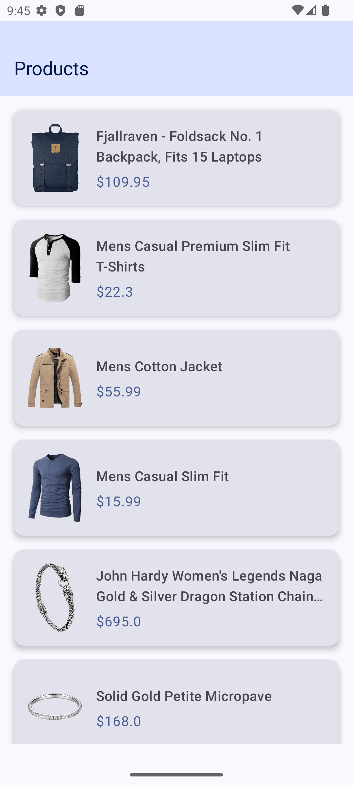
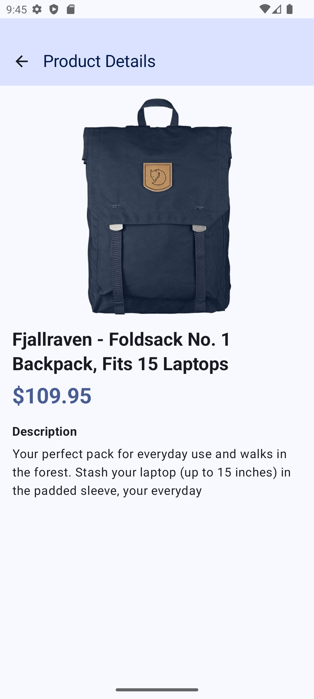

# POC - Clean Architecture

This application demonstrates a modular, scalable architecture using modern Android development practices.

## Architecture & Tech Stack

- **Architecture:** Clean Architecture with MVVM
- **Modularization:** Multi-module setup (`app`, `:core:common`, `:core:network`, `:feature:list`)
- **UI:** Jetpack Compose (using Material 3)
- **Dependency Injection:** Hilt
- **Network Layer:** Retrofit + OkHttp
- **Asynchronous Operations:** Kotlin Coroutines & Flows
- **Testing:** JUnit, MockK, Coroutines Test
- **Image Loading:** Coil

## Module Structure
- **app**: Handles standard App configurations and acts as the entry point and dependency wiring layer.
- **core:common**: Common wrappers like `Result<T>` handling state.
- **core:network**: Global networking configuration (e.g. Retrofit instances, Interceptors).
- **feature:list**: Self-contained module for fetching and displaying the list of products and showing product details.

## Features
- List of products.
- Product Details screen via Navigation Compose.

## Unit Testing
The application employs a robust unit testing strategy for the Presentation (ViewModels) and Domain (UseCases) layers.

- **Frameworks:** JUnit 4, MockK (for mocking dependencies like Repositories), and `kotlinx-coroutines-test` (for testing Suspend functions and Flows).```
## App Screenshots

<div align="center">
  
  &nbsp;&nbsp;&nbsp;&nbsp;
  
</div>
